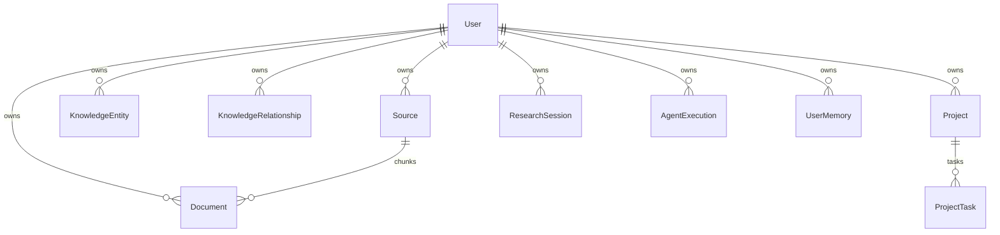

# Data Model

```mermaid
erDiagram
  User ||--o{ Source : owns
  User ||--o{ Document : owns
  User ||--o{ KnowledgeEntity : owns
  User ||--o{ KnowledgeRelationship : owns
  User ||--o{ Project : owns
  User ||--o{ ResearchSession : owns
  User ||--o{ AgentExecution : owns
  User ||--o{ UserMemory : owns
  Source ||--o{ Document : chunks
  Project ||--o{ ProjectTask : tasks
```
11 tables in `apps/api/app/models/models.py`.
