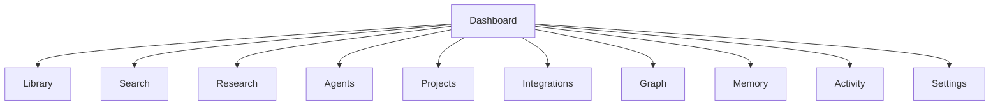

# Information Architecture

```mermaid
flowchart TB
  HOME[Dashboard] --> LIB[Library] & SRCH[Search] & RES[Research] & AG[Agents] & PROJ[Projects] & INT[Integrations] & G[Graph] & MEM[Memory] & ACT[Activity] & SET[Settings]
```
URL structure mirrors the sidebar nav. Auth gate: unauthenticated → `/login`.
